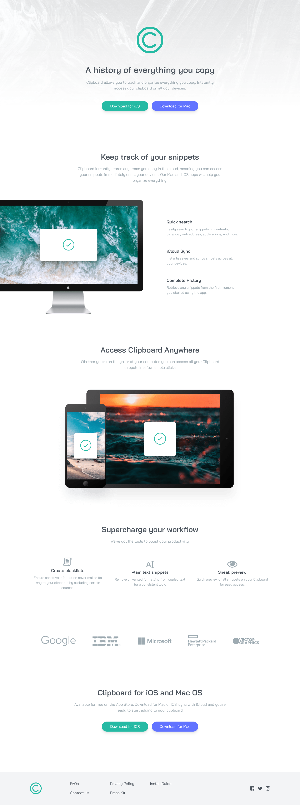
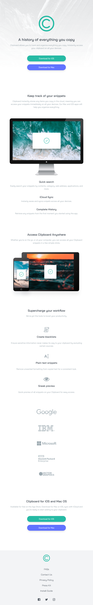
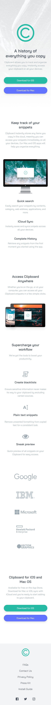

# Frontend Mentor - Clipboard landing page solution

This is a solution to the [Clipboard landing page challenge on Frontend Mentor](https://www.frontendmentor.io/challenges/clipboard-landing-page-5cc9bccd6c4c91111378ecb9). Frontend Mentor challenges help you improve your coding skills by building realistic projects. 

## Table of contents

- [Overview](#overview)
  - [The challenge](#the-challenge)
  - [Screenshot](#screenshot)
  - [Links](#links)
- [My process](#my-process)
  - [Built with](#built-with)
  - [What I learned](#what-i-learned)
  - [Continued development](#continued-development)
  - [Useful resources](#useful-resources)
- [Author](#author)


## Overview

### The challenge

Users should be able to:

- View the optimal layout for the site depending on their device's screen size
- See hover states for all interactive elements on the page

### Screenshot

#### Large Devices


#### Medium Devices


#### Small Devices



### Links

- Solution URL: [Add solution URL here](https://your-solution-url.com)
- Live Site URL: [insert link](link)

## My process

### Built with

- Semantic HTML5 markup
- [Tailwind CSS](https://tailwindcss.com/) - A utility-first CSS framework 
- Flexbox
- CSS Grid
- Mobile-first workflow


### What I learned

I was able to add custom colors using JIT mode in Tailwind CSS

Here's how I added the colors in the tailwind.config.js:

```css
theme: {
    extend: {
      colors: {
        strongcyan: "hsl(171, 66%, 44%)",
        lightblue: "hsl(233, 100%, 69%)",
        darkgray: "hsl(210, 10%, 33%)",
        grayblue: "hsl(201, 11%, 66%)",
      },
    },
  },
```
I added the colors under extend so it would not override the default colors that are available in Tailwind CSS.

Here's how I ran the project where JIT is enabled:

```
npx tailwindcss -o ./build/tailwind.css --jit --purge "./**/*.html" -w
```

### Continued development

The code could use some peer review for refactoring, and Javascript for functionality.

### Useful resources

- [Tailwind CSS Documentation](https://tailwindcss.com/docs) - This helped me get started with Tailwind CSS.
- [W3Schools HTML Tutorial](https://www.w3schools.com/html/) - This is an amazing website to review HTML concepts.
- [Font Awesome](https://fontawesome.com/) - Provides a large source of icons that are ready to use.

## Author
- LinkedIn - [@mvsgarcia](https://www.linkedin.com/in/mvsgarcia/)
- Frontend Mentor - [@mvsgarcia](https://www.frontendmentor.io/profile/mvsgarcia)

